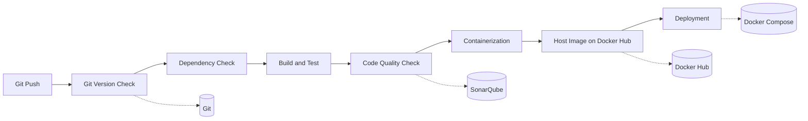

# DevOps Lab — TaskFlow CI/CD Write-Up

**Student project:** TaskFlow (full-stack task management app)  
**CI/CD tool:** Jenkins  
**Container registry:** Docker Hub  
**Code quality:** SonarQube (local zip install)

---

## 1. Problem Statement (Project Description)

**TaskFlow** is a full-stack web application for project and task management. It helps users organise work across multiple projects in one place, with a simple and modern interface.

The application allows users to:

- **Create and manage projects** — add new projects and remove ones that are no longer needed.
- **Manage tasks within each project** — create tasks, assign them to a project, and delete tasks when done.
- **Use a Kanban board** — view tasks in three columns (To Do, In Progress, Done) and move tasks between statuses as work progresses.
- **View a dashboard** — see project and task statistics using pie and bar charts powered by Chart.js.

The system is split into two parts:

- **Frontend (React + Vite)** — the user interface, built with Tailwind CSS for a responsive layout. It communicates with the backend through REST API calls using Axios.
- **Backend (Flask)** — a REST API that handles projects and tasks. Data is stored in **MongoDB Atlas**, a cloud database, using PyMongo.

TaskFlow is containerised with Docker and delivered through a Jenkins CI/CD pipeline so that every code change is built, tested, checked for quality, and deployed automatically.

---

## 2. Tech Stack

| Layer | Technology | Purpose |
|-------|------------|---------|
| **Frontend** | React, Vite, Tailwind CSS, Axios, Chart.js | User interface, Kanban board, dashboard charts |
| **Backend** | Flask, Flask-CORS, PyMongo | REST API for projects and tasks |
| **Database** | MongoDB Atlas | Cloud-hosted persistent storage |
| **Version control** | Git, GitHub/GitLab | Source code management and pipeline trigger |
| **CI/CD** | Jenkins, Jenkinsfile | Automated build, test, scan, push, deploy |
| **Code quality** | SonarQube, SonarScanner | Static analysis, bugs, smells, quality gate |
| **Containerization** | Docker, Docker Compose | Reproducible backend + frontend containers |
| **Image registry** | Docker Hub | Store and distribute built images |

---

## 3. Pipeline Diagram (Jenkins)



**ASCII overview:**

```
Git Push
   │
   ▼
┌─────────────────────────────────────────────────────────────────────┐
│                        JENKINS PIPELINE                              │
├─────────────┬─────────────┬──────────────┬────────────┬────────────┤
│ Git Version │ Dependency  │ Build & Test │ Code       │ Container- │
│ Check       │ Check       │              │ Quality    │ ization    │
├─────────────┴─────────────┴──────────────┴────────────┴────────────┤
│ Host Image on Docker Hub  →  Deployment (Docker Compose)            │
└─────────────────────────────────────────────────────────────────────┘
```

---

## 4. Pipeline Stages — Tool, Use, and Outcome

| Stage | Tool | What it does | Outcome |
|-------|------|--------------|---------|
| **1. Git Version Check** | Git | Runs `git --version` and `git log -1` | Confirms Git is installed; shows which commit is being built |
| **2. Dependency Check** | OWASP Dependency-Check | Scans project for vulnerable dependencies (`odcInstallation: DP`) | Security report published in Jenkins |
| **3. Build** | Vite | Runs `npm run build` | Production frontend bundle created |
| **4. Test** | unittest, npm test | Runs backend and frontend tests | Basic pass/fail before deploy |
| **5. Code Quality Check** | SonarScanner + SonarQube (`SonarQube-server`) | Scans `backend` and `frontend/src`, waits for quality gate | Bugs, smells, and quality report for `devops-lab-exam` in SonarQube |
| **6. Containerization** | Docker | `docker build` for backend and frontend Dockerfiles | Images: `thatoneukie/taskflow-backend`, `thatoneukie/taskflow-frontend` |
| **7. Host Image on Docker Hub** | Docker Hub | `docker login` + `docker push` | Images hosted at hub.docker.com/u/thatoneukie |
| **8. Deployment** | Docker Compose | `docker-compose up --build -d` | App live on port 5173 (frontend) and 5000 (backend) |

---

## 5. Exam Checklist (Rubric Mapping)

| Exam requirement | Pipeline stage |
|------------------|----------------|
| Git version | **Git Version Check** |
| Dependency check | **Dependency Check** |
| Code quality check | **Code Quality Check** |
| Containerization | **Containerization** |
| Hosting image in Docker Hub | **Host Image on Docker Hub** |
| Deployment | **Deployment** |

**Before exam day:** Run the pipeline once (Build Now or git push) and keep a **successful build from the previous day** visible in Jenkins. The examiner will match the build to this project’s code.

---

## 6. Git Commands (Demo / Viva — 10 marks)

Practice these on the exam laptop. Replace paths and URLs with yours.

```bash
# Version check (pipeline + viva)
git --version

# Clone the project
git clone <your-repo-url>
cd devops

# Check status and branch
git status
git branch

# View commit history
git log --oneline -5

# See latest commit (same as pipeline)
git log -1

# See remote repository
git remote -v

# Pull latest changes
git pull origin main

# Stage, commit, push (triggers Jenkins if webhook is set)
git add .
git commit -m "Update TaskFlow feature"
git push origin main

# Show diff before committing
git diff
```

**What to say in viva:** Git tracks every code change. Jenkins is connected to the Git repo; a push triggers the pipeline so the built artifact always matches a specific commit hash.

---

## 7. Docker Commands (Demo / Viva — 10 marks)

```bash
# Version check
docker --version
docker compose version

# Build images manually (same as pipeline)
docker build -t <dockerhub-user>/taskflow-backend:latest ./backend
docker build -t <dockerhub-user>/taskflow-frontend:latest ./frontend

# List images
docker images

# Login to Docker Hub
docker login

# Push to Docker Hub
docker push <dockerhub-user>/taskflow-backend:latest
docker push <dockerhub-user>/taskflow-frontend:latest

# Run with Compose (deployment)
docker compose up --build -d

# Check running containers
docker ps

# View logs
docker compose logs -f

# Stop deployment
docker compose down

# Pull your images from another machine
docker pull <dockerhub-user>/taskflow-backend:latest
docker pull <dockerhub-user>/taskflow-frontend:latest
```

**What to say in viva:** Docker packages the app and its dependencies into images. Docker Hub is the registry where images are stored. Deployment pulls (or uses locally built) images and runs them as containers via Docker Compose.

---

## 8. Viva Preparation (10 marks — individual)

Be ready to explain in your own words:

1. **Why CI/CD?** — Faster feedback, fewer manual errors, repeatable builds.  
2. **What triggers your pipeline?** — Git push (webhook) or manual “Build Now” in Jenkins.  
3. **What is SonarQube?** — Static analysis tool; finds bugs, code smells, security issues before deploy.  
4. **What is a Dockerfile?** — Recipe to build an image (base OS, install deps, copy code, run command).  
5. **What is Docker Compose?** — Runs multiple containers (backend + frontend) with one command.  
6. **Why Docker Hub?** — Central place to store images so any machine can deploy the same version.  
7. **What happens if tests fail?** — Pipeline stops (or later stages are skipped); broken code is not deployed.  
8. **Difference between image and container?** — Image is the template; container is a running instance of that image.

---

## 9. One-Time Setup (Not run during exam)

- Jenkins job pointing to this repo’s `Jenkinsfile`  
- SonarQube running locally (`StartSonar.bat`), project key `taskflow`  
- Jenkins credentials: SonarQube token, Docker Hub username/password  
- Docker Hub repositories: `taskflow-backend`, `taskflow-frontend`  
- Successful pipeline build completed **the day before** the exam  

---

*Project: TaskFlow | Pipeline: Jenkins | Registry: Docker Hub | Quality: SonarQube*
